# TIPE – Slitherlink

> **Nohlan SAUCET** — TIPE 2025‑2026  
> Résolution et génération de puzzles **Slitherlink** par méthodes algorithmiques : backtracking avec propagation de contraintes et résolution SMT via Z3.

---

## Table des matières

1. [Le puzzle Slitherlink](#le-puzzle-slitherlink)
2. [Structure du projet](#structure-du-projet)
3. [Installation](#installation)
4. [Modélisation](#modélisation)
5. [Génération de puzzles](#génération-de-puzzles)
6. [Résolution](#résolution)
7. [Visualiseur interactif (Pygame)](#visualiseur-interactif-pygame)
8. [Référence de l'API](#référence-de-lapi)
9. [Exemple d'utilisation](#exemple-dutilisation)
10. [Benchmarks](#benchmarks)
11. [Sources](#sources)
12. [État du projet](#état-du-projet)

---

## Le puzzle Slitherlink

Le Slitherlink est un puzzle logique japonais édité par Nikoli. L'objectif est de relier des points d'une grille rectangulaire pour former **une unique boucle fermée**, sans croisement ni bifurcation, en respectant les indices numériques qui indiquent combien d'arêtes entourent chaque cellule (0 à 3, ou case vide si l'indice est masqué).

| Grille vierge | Solution |
|:---:|:---:|
| 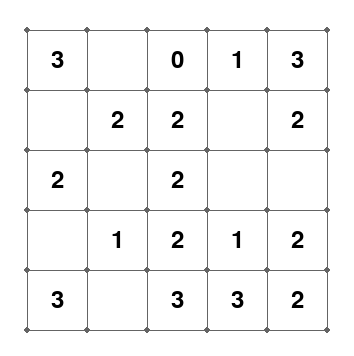 | 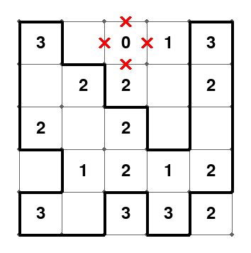 |

Exemple d'une grande instance résolue :

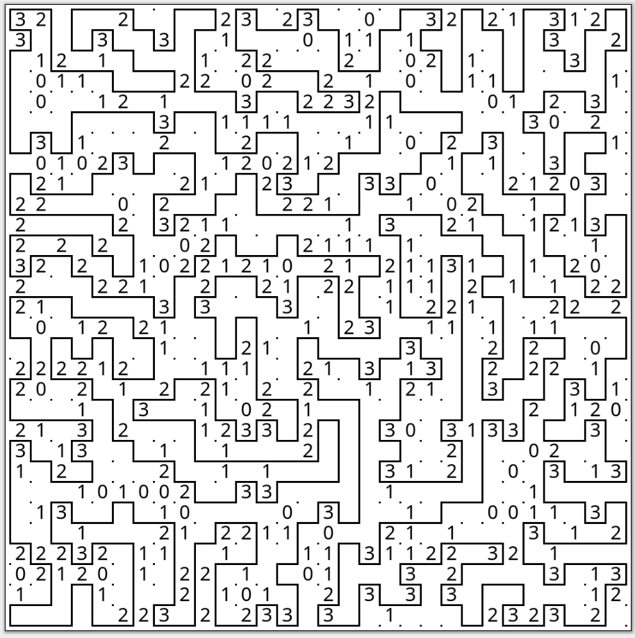

---

## Structure du projet

```
TIPE/
├── python/
│   ├── SlitherLink.py                # Bibliothèque principale : génération, vérification, résolution
│   ├── pygame_visualiseur.py         # Interface interactive (éditeur + mode jeu)
│   └── Fonction de SlitherLink.txt   # Référence rapide de toutes les fonctions
├── images/                           # Captures d'écran, graphiques de benchmark, illustrations
├── Source/                           # Articles scientifiques de référence (PDF)
│   ├── ISSN_algorithm.pdf
│   ├── hexagonal_NP_Complete.pdf
│   ├── FPGA_SMT_Solver.pdf
│   ├── Gerhard_van_der_Knijff_...pdf
│   └── ...
└── README.md
```

---

## Installation

**Python 3.8+** requis.

```bash
pip install pygame matplotlib numpy z3-solver
```

| Bibliothèque | Rôle |
|---|---|
| `pygame` | Visualiseur interactif |
| `matplotlib` / `numpy` | Affichage des grilles et calculs matriciels |
| `z3-solver` | Résolution par satisfaisabilité modulo théories (SMT) |

Pour utiliser la bibliothèque seule (sans visualiseur) :

```bash
pip install matplotlib numpy z3-solver
```

---

## Modélisation

### Représentation de la grille

Une grille n×m est modélisée par deux matrices :

- **La matrice de solution `M`** — matrice booléenne indiquant si chaque cellule est à l'intérieur (`True`) ou à l'extérieur (`False`) de la boucle. Les arêtes de la boucle correspondent aux frontières entre cellules de valeurs différentes.
- **La matrice d'indices `Na`** — matrice entière donnant le nombre d'arêtes bordant chaque cellule (0–3), ou `-1` si l'indice est masqué.

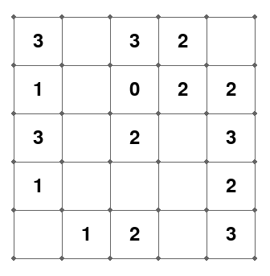

### Modèle 2-coloration

La contrainte de boucle unique est vérifiée via un **modèle de 2-coloration** : les cellules intérieures à la boucle reçoivent une couleur, les cellules extérieures une autre. Une arête appartient à la boucle si et seulement si elle sépare deux cellules de couleurs différentes.

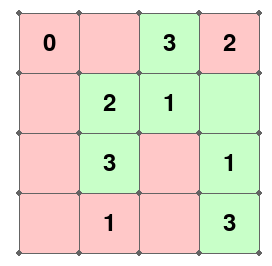

Ce modèle permet de vérifier la validité d'une configuration de façon efficace, sans parcourir explicitement le chemin.

---

## Génération de puzzles

Cinq méthodes de génération ont été développées et comparées :

### Grignotage récursif (`grignotage_rec`)

On part d'une boucle pleine (toutes les cellules intérieures) et on retire des cellules une à une de façon récursive en maintenant la validité de la boucle à chaque étape.

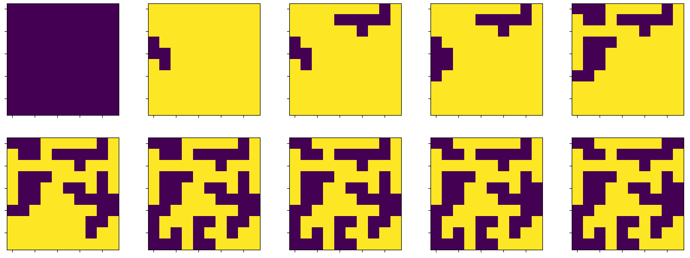

### Grignotage carré + crevasse (`grignotage_carré`)

Variante qui retire des blocs carrés pour aller plus vite, puis creuse des « crevasses » pour complexifier la forme de la boucle.

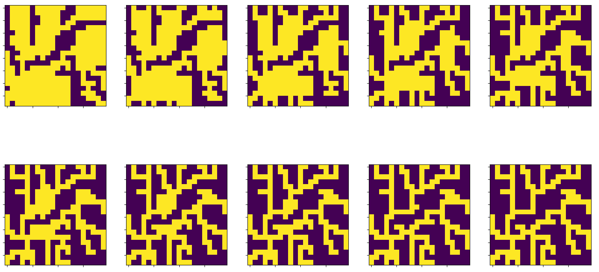

### Génération par chemins (`generation_par_chemins`, `generation_par_chemins_complexes`)

Construction de la boucle par assemblage de chemins simples ou complexes reliant des points de la grille.

### Génération par labyrinthe (`generation_par_labyrinthe`)

Utilise un algorithme de génération de labyrinthe (exploration récursive avec historique) pour construire une boucle aux propriétés structurelles différentes.

### Méthode par mutation (`mutation`)

Génère une solution initiale puis la fait évoluer par modifications locales aléatoires, en conservant uniquement les mutations valides.

### Critère de modifiabilité

Un critère de **modifiabilité** permet d'évaluer la difficulté d'un puzzle généré : une case est dite *modifiable* si son indice peut varier sans invalider l'unicité de la solution. Plus le nombre de cases modifiables est élevé, plus le puzzle est ambigu.

| nb_modif 5 | nb_modif 7 | nb_modif 9 | nb_modif 10 |
|:---:|:---:|:---:|:---:|
|  |  |  |  |

---

## Résolution

### Backtracking avec propagation de contraintes (`backtrack_solver_all`)

Algorithme de backtracking original avec **propagation de contraintes et élagage précoce**. L'état courant maintient une matrice `Na_M` des arêtes déjà comptabilisées, mise à jour incrémentalement à chaque assignation. Plusieurs conditions sont vérifiées avant de développer un nœud :

- Contrainte diagonale (non-croisement)
- Contrainte bas / droite (indices locaux)
- Contrainte de plaçabilité (intérieur / extérieur)

L'algorithme trouve **toutes les solutions** d'un puzzle. Lorsque l'ensemble des indices est fourni, il parvient à résoudre des instances de **1000×1000** en temps raisonnable.

### Solveur SMT — Z3 (`z3_solver`)

Reformulation du puzzle en un problème de **satisfaisabilité modulo théories**. Les contraintes (indices, connexité, boucle unique via 2-coloration) sont encodées comme des formules logiques et soumises au solveur Z3. Cette approche est particulièrement robuste lorsque peu d'indices sont fournis.

---

## Visualiseur interactif (Pygame)

```bash
cd python
python pygame_visualiseur.py
```

### Contrôles

| Mode | Touche / action | Effet |
|---|---|---|
| **Édition** | `← ↑ ↓ →` | Déplacer la case sélectionnée |
| | `0…4` | Entrer un indice dans la case |
| | `5` ou `?` | Masquer l'indice de la case (`-1`) |
| | `C` | Changer la couleur de fond |
| | `E` | Passer en mode jeu |
| | `G` | Afficher / masquer le quadrillage |
| **Jeu** | Clic gauche | Tracer une arête (noire) |
| | Clic droit | Marquer une arête interdite (croix rouge) |
| | Clic milieu | Effacer l'arête |
| | `E` | Revenir en mode édition |

---

## Référence de l'API

Toutes les fonctions sont définies dans `python/SlitherLink.py`.

### Génération

| Fonction | Signature | Description |
|---|---|---|
| `grignotage_rec` | `(n, m, N=-1) -> M` | Grignotage récursif |
| `grignotage_carré` | `(M, n, m, proba=0.8) -> M` | Grignotage par blocs carrés |
| `generation_par_chemins` | `(n, m) -> M` | Chemins simples |
| `generation_par_chemins_complexes` | `(n, m) -> M` | Chemins complexes |
| `generation_par_labyrinthe` | `(n, m) -> M` | Approche labyrinthe |
| `mutation` | `(N, n, m) -> M` | Génération par mutation |
| `generer` | `(n, m, p=0) -> Na` | Génère directement un puzzle (matrice d'indices) |
| `generer_unique_sol` | `(n, m, tentative) -> (Na, compteur)` | Génère un puzzle à solution unique |

### Vérification

| Fonction | Signature | Description |
|---|---|---|
| `Verif` | `(M) -> bool` | Teste si `M` forme une boucle unique valide |
| `Nombre_Arrete` | `(M) -> Na` | Calcule la matrice d'indices depuis une solution |
| `modifiable` | `(M, i, j) -> bool` | Teste si la case (i,j) est modifiable |

### Résolution

| Fonction | Signature | Description |
|---|---|---|
| `backtrack_solver` | `(Na) -> (M, Na)` | Backtracking — première solution |
| `backtrack_solver_all` | `(Na) -> list[M]` | Backtracking — toutes les solutions |
| `z3_solver` | `(Na) -> list[M]` | Résolution SMT avec Z3 |
| `brut_force_solver` | `(Na) -> M or None` | Force brute (référence) |
| `heuristique_solver` | `(N, tentative=100) -> (M, Na) or None` | Solveur heuristique |

### Visualisation

| Fonction | Signature | Description |
|---|---|---|
| `show` | `(M)` | Affiche une grille |
| `show_gris` | `(M)` | Affiche en niveaux de gris |
| `show_2` | `(M, NA)` | Affiche solution et indices côte à côte |
| `show_n` | `(L, n, m)` | Affiche plusieurs grilles côte à côte |
| `show_anim` | `(L, interval=200)` | Animation d'une séquence de grilles |

### Analyse & filtres

| Fonction | Signature | Description |
|---|---|---|
| `List_puzzle` | `(n, m, equiv=False) -> L` | Liste tous les puzzles n×m valides |
| `filtre_diag` | `(L) -> L` | Filtre les grilles avec motifs diagonaux |
| `filtre_equiv` | `(L) -> L` | Filtre les équivalences par symétrie |
| `filtre_puzzle` | `(L) -> L` | Filtre les grilles invalides |
| `filtre_nombre_modifiable` | `(L, mini, maxi) -> L` | Filtre par nombre de cases modifiables |
| `comparaison_Solver` | `(debut, fin, pas, p, test_par_taille)` | Benchmark BT vs Z3 |

---

## Exemple d'utilisation

```python
from SlitherLink import grignotage_rec, backtrack_solver_all, show, Nombre_Arrete

# 1. Générer une boucle solution aléatoire 6×6
M = grignotage_rec(6, 6)

# 2. Dériver la grille d'indices (le puzzle)
Na = Nombre_Arrete(M)

# 3. Résoudre le puzzle
solutions = backtrack_solver_all(Na)
print(f"{len(solutions)} solution(s) trouvée(s)")

# 4. Afficher la première solution
if solutions:
    show(solutions[0])
```

Utilisation du solveur Z3 (préférable avec peu d'indices) :

```python
from SlitherLink import generer_unique_sol, z3_solver, show

# Générer un puzzle à solution unique
Na, _ = generer_unique_sol(5, 5, tentative=50)

# Résoudre avec Z3
solutions = z3_solver(Na)
if solutions:
    show(solutions[0])
```

---

## Benchmarks

Les benchmarks comparent le backtracking (rouge) et Z3 (bleu) en fonction de la taille de la grille et du taux de cases non-indicées.

| 0 % masqués | 20 % masqués |
|:---:|:---:|
| 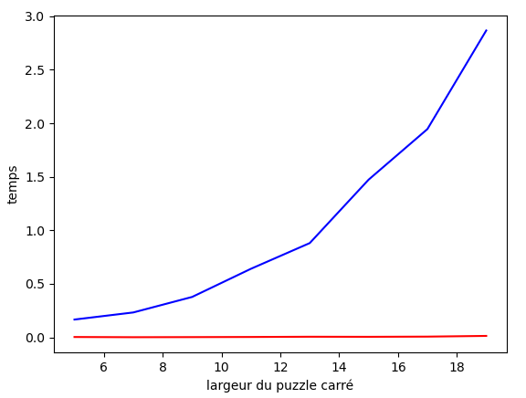 | 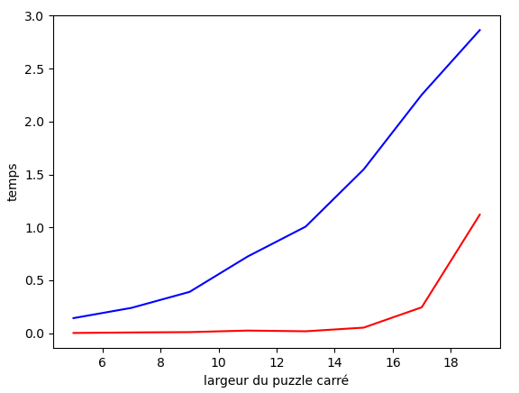 |

| 25 % masqués | 50 % masqués |
|:---:|:---:|
| 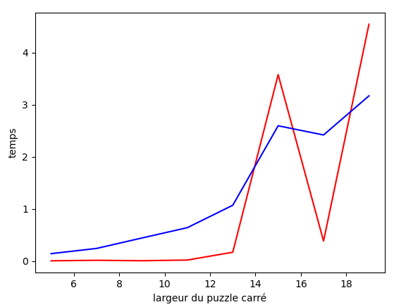 | 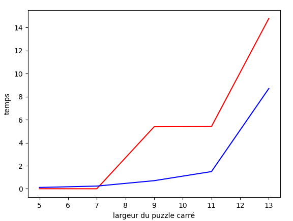 |

**Conclusion :** Le backtracking est très efficace lorsque les indices sont nombreux (peu de cases masquées), grâce à l'élagage agressif par propagation de contraintes. Z3 résiste mieux à la raréfaction des indices : lorsque le puzzle est peu contraint, le solveur SMT maintient des performances stables là où le backtracking explore un espace combinatoire beaucoup plus grand.

---

## Sources

Les articles scientifiques sont disponibles dans `Source/` :

| Fichier | Contenu |
|---|---|
| `ISSN_algorithm.pdf` | Résolution du Slitherlink par l'algorithme ISSN |
| `hexagonal_NP_Complete.pdf` | Complexité NP-complète sur grilles hexagonales |
| `FPGA_SMT_Solver.pdf` | Implémentation FPGA d'un solveur SMT |
| `Gerhard_van_der_Knijff_...pdf` | Génération de puzzles avec contrainte de connectivité |
| `algorithms-05-00176.pdf` | Algorithmes de résolution de puzzles logiques |
| `2308.08798v1.pdf` / `2410.19078v1.pdf` | Articles complémentaires |

---

## État du projet

- [x] Modélisation 2-coloration
- [x] Génération multi-méthodes (grignotage, chemins, labyrinthe, mutation)
- [x] Backtracking complet avec propagation de contraintes
- [x] Solveur Z3 (SMT)
- [x] Benchmarks comparatifs
- [x] Visualiseur interactif Pygame
- [x] Critère de modifiabilité et filtres de puzzles
- [x] Interface de résolution intégrée au visualiseur
- [ ] Export / import de puzzles (format standard)
