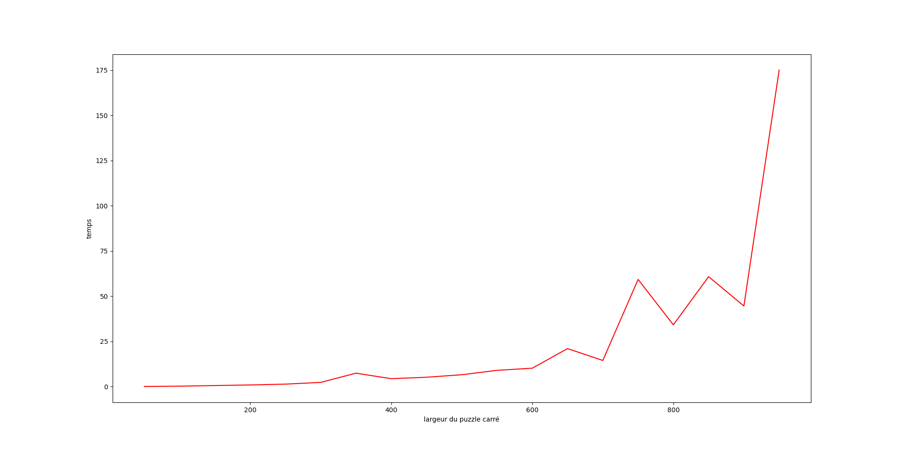

# TIPE – Slither Link

> Projet TIPE 2025‑2026 — **Nohlan SAUCET**  
> Résolution et génération de puzzles **Slitherlink** par méthodes algorithmiques (backtracking, SMT/Z3).

---

## Le puzzle Slitherlink

Le Slitherlink est un puzzle logique japonais (Nikoli) : relier des points d'une grille pour former **une unique boucle fermée**, en respectant les indices numériques qui indiquent combien d'arêtes entourent chaque cellule.

| Grille vierge | Solution |
|:---:|:---:|
|  |  |

Exemple de grande instance résolue :


---

## Structure du projet

```
TIPE/
├── python/
│   ├── SlitherLink.py            # Module principal : génération, vérification, résolution
│   └── pygame_visualiseur.py     # Interface interactive (éditeur + mode jeu)
├── images/                       # Captures, graphiques, illustrations
├── Source/                       # Articles scientifiques de référence (PDF)
└── README.md
```

---

## Modélisation

### Représentation de la grille

Une grille n×n est représentée comme une matrice d'indices. Les arêtes entre cellules forment la boucle solution. Chaque cellule porte un indice (0–3) indiquant le nombre d'arêtes qui la bordent, ou `-1` si l'indice est masqué.


### Modèle 2 couleurs

La contrainte de boucle unique est vérifiée grâce à un **modèle de 2-coloration** : les cellules intérieures à la boucle reçoivent une couleur, les cellules extérieures une autre. Une arête appartient à la boucle si et seulement si elle sépare deux cellules de couleurs différentes.


Ce modèle permet de reformuler la vérification de validité de façon efficace, sans parcourir explicitement le chemin.

---

## Génération de puzzles

Plusieurs méthodes de génération ont été développées et comparées.

### Grignotage récursif

On part d'une boucle pleine (toutes les cellules intérieures) et on retire des cellules une à une de façon récursive en maintenant la validité de la boucle.


### Grignotage carré + crevasse

Variante qui retire des blocs carrés puis creuse des « crevasses » pour complexifier la forme.


### Taux de cases modifiables

Un critère de **modifiabilité** mesure la difficulté générée : une case est modifiable si son indice peut varier sans invalider la solution. Le tableau ci-dessous montre l'évolution du nombre de cases modifiables selon les étapes de génération sur une grille 4×4 :

| nb_modif 5 | nb_modif 7 | nb_modif 9 | nb_modif 10 |
|:---:|:---:|:---:|:---:|
|  |  |  |  |

---

## Résolution

### Backtracking intelligent (`solve_SL_all`)

Algorithme de backtracking original : propagation de contraintes et élagage précoce. Trouve toutes les solutions d'un puzzle. Lorsque le puzzle fournit l'ensemble des indices, l'algorithme implémenté est capable de prouesse en resolvant des puzzles slitherlink de 1000 par 1000 !



### Solveur SMT — Z3 (`z3_solver`)

Reformulation du puzzle en un problème de **satisfaisabilité modulo théories** (SMT). Les contraintes (indices, boucle unique) sont encodées comme des formules logiques et soumises au solveur Z3.

### Comparaison Backtracking vs Z3

Les benchmarks ci-dessous comparent les deux méthodes en fonction de la taille de la grille et du taux de cases non-indicées :

| 0 % masqués | 20 % masqués |
|:---:|:---:|
|  |  |

| 25 % masqués | 50 % masqués |
|:---:|:---:|
|  |  |

> **Conclusion** : Le Backtracking original (rouge) implémenté dans ce github est un excellent solver lorsque le nombre d'indice est grand dans le puzzle une implementation z3 (bleu) résiste cependant bien mieux au nombre d'indice qui diminue.

---

## Visualiseur interactif (Pygame)

```bash
python pygame_visualiseur.py
```

| Mode | Touche / action | Effet |
|---|---|---|
| **Édition** | `← ↑ ↓ →` | Déplacer la case sélectionnée |
| | `0…4` | Entrer un indice dans la case |
| | `5` ou `?` | Mettre une case sans indice (`-1`) |
| | `C` | Changer la couleur de fond |
| | `E` | Passer en mode jeu |
| | `G` | Afficher/masquer le quadrillage |
| **Jeu** | clic gauche | Tracer une arête noire |
| | clic droit | Tracer une croix rouge (arête interdite) |
| | clic milieu | Effacer l'arête |
| | `E` | Revenir en mode édition |

---

## Installation

**Python 3.8+** requis.

```bash
pip install pygame matplotlib numpy z3-solver
```

| Bibliothèque | Rôle |
|---|---|
| `pygame` | Interface interactive |
| `matplotlib` / `numpy` | Affichage et calculs matriciels |
| `z3-solver` | Résolution par contraintes SMT |

---

## Principales fonctions (`SlitherLink.py`)

### Génération
| Fonction | Description |
|---|---|
| `grignotage_rec(n, m)` | Génération par grignotage récursif |
| `grignotage_carre(n, m)` | Génération par blocs carrés |
| `generate_chemins(n, m)` | Génération par chemin aléatoire |
| `generate_maze(n, m)` | Génération type labyrinthe |

### Vérification
| Fonction | Description |
|---|---|
| `Verif(M)` | Teste si M forme une boucle unique valide |
| `Nombre_Arrete(M)` | Calcule la matrice des indices à partir d'une solution |

### Résolution
| Fonction | Description |
|---|---|
| `solve_SL_all(Na)` | Backtracking — toutes les solutions |
| `z3_solver(Na)` | Résolution SMT avec Z3 |

### Affichage
| Fonction | Description |
|---|---|
| `show(M)` | Affiche une grille |
| `show_n(liste)` | Affiche plusieurs grilles côte à côte |
| `show_anim(liste)` | Animation d'une séquence de grilles |

---

## Exemple d'utilisation

```python
from SlitherLink import grignotage_rec, solve_SL_all, show, Nombre_Arrete

# Générer une solution aléatoire 6x6
M = grignotage_rec(6, 6)

# Calculer la grille d'indices
Na = Nombre_Arrete(M)

# Résoudre
solutions = solve_SL_all(Na)
print(f"{len(solutions)} solution(s) trouvée(s)")

# Afficher
if solutions:
    show(solutions[0])
```

---

## Sources

Les articles scientifiques utilisés sont disponibles dans `Source/` :

- Résolution du Slitherlink par contraintes (ISSN algorithm)
- Complexité NP-complète du Slitherlink sur grilles hexagonales
- Implémentation FPGA d'un solveur SMT
- Génération de puzzles avec contrainte de connectivité (Gerhard van der Knijff)
- Algorithmes de résolution de puzzles logiques

---

## État du projet

- [x] Visualiseur interactif (Pygame)
- [x] Génération de grilles (multi-méthodes)
- [x] Backtracking complet (toutes les solutions)
- [x] Solveur Z3
- [x] Benchmarks comparatifs
- [ ] Interface de résolution intégrée au visualiseur
